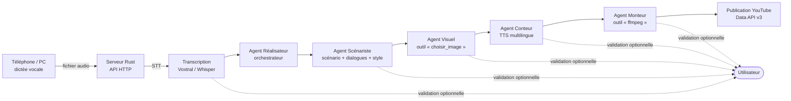

# Automatisation de vidéos éducatives par LLM

Documentation du projet : pipeline complet de création de vidéos éducatives,
de la dictée vocale jusqu'à la publication YouTube, orchestré par des agents
LLM écrits en Rust.

## Décision technique (résumé)

**Framework retenu : [`rig`](https://github.com/0xPlaygrounds/rig) (crate `rig-core`).**
Justification détaillée dans [architecture.md](architecture.md#3-décision--rig-core).

## Vue d'ensemble du flux

Chaque étape (4 à 9 du cahier des charges) est configurable :
**automatique** ou **en attente de validation**, avec possibilité d'affiner le
résultat d'un agent via un prompt dédié avant de continuer.

## Index des documents

| Document | Contenu |
|---|---|
| [architecture.md](architecture.md) | État de l'art, choix du framework Rust, arborescence du workspace, spécification des 5 agents et des outils LLM, machine à états du pipeline |
| [agenda.md](agenda.md) | Planification en 8 phases / 12 semaines, jalons, critères de sortie, risques |

## Périmètre

- **Entrée** : fichier audio dicté (téléphone ou ordinateur) envoyé au serveur.
- **Traitement** : STT → scénario → visuels libres de droits → voix off
  multilingue → montage ffmpeg → sous-titres.
- **Sortie** : vidéo publiée sur YouTube via la Data API v3.
- **Plateforme** : Linux, 100 % Rust, LLM via API (Mistral) ou LLM local sur
  serveur GPU (Ollama / vLLM) sans changement de code des agents.
